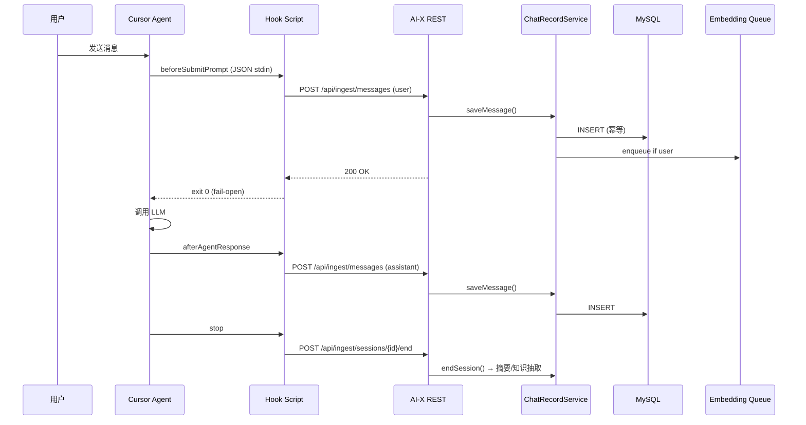

# AI-X Cursor Hooks 自动采集 — 技术选项文档

> 版本：v1.1  
> 日期：2026-06-13  
> 状态：待评审  
> 关联需求：[requirements.md](./requirements.md) §4.2 对话记录、§7 技术架构、§9.2 REST API

---

## 1. 文档目的

在 AI-X 需求基础上，明确 **Cursor Hooks 自动对话采集** 的技术选型、架构边界与实现路径，为 M1（基础闭环）中的「实时记录」场景提供可落地的工程决策依据。

**核心目标：**

- 用户在 Cursor 中与 AI 对话时，**无需手动调用 MCP Tool**，对话自动写入 AI-X；
- Hook 层与 MCP 层 **共用同一套领域服务**（`ChatRecordService`），避免双写逻辑分叉；
- 满足需求指标：对话采集完整率 ≥ 99%、`record_message` 同步路径 ≤ 500ms（不含 embedding）。

---

## 2. 背景与约束

### 2.1 为何引入 Cursor Hooks

MCP Tool（`record_message`）属于 **旁路调用**，依赖 LLM 主动触发，无法保证每轮对话入库。Cursor Hooks 挂在 Agent 生命周期上，可在用户发消息前、AI 回复后自动触发，语义上接近「拦截器」。

### 2.2 适用范围

| 维度 | 说明 |
|------|------|
| 适用客户端 | **仅 Cursor**（Hooks 为 Cursor 私有机制） |
| 不适用 | Claude Desktop、VS Code 其他 AI 插件、自研 Client |
| 与 MCP 关系 | Hooks 负责 **采集**；MCP 仍负责 **检索、知识库、分析、补录** |

### 2.3 需求映射

| 需求条目 | Hooks 方案如何满足 |
|----------|-------------------|
| §4.2.1 Session | `sessionStart` / `stop` 触发 `start_session` / `end_session` |
| §4.2.2 Message | `beforeSubmitPrompt` / `afterAgentResponse` 触发 `record_message` |
| §4.2.3 幂等 | 使用 `clientMessageId`（Hook 输入中的 message / conversation 标识） |
| §4.2.3 向量化 | user 消息入库后由 `ChatRecordService` 异步 enqueue（与 MCP 路径一致） |
| §5.1 性能 | Hook 脚本仅做 HTTP 上报，超时 ≤ 3s，不阻塞主对话（fail-open） |
| §5.3 安全 | 本地 REST + Token 鉴权；可选敏感信息脱敏 |
| §9.2 REST API | 由「可选」升级为 **采集必需**，新增 POST 写入接口 |

---

## 3. 总体架构

### 3.1 推荐架构（选项 A — 已选定）

```
┌──────────────────────────────────────────────────────────────────┐
│                        Cursor IDE                                 │
│  ┌─────────────┐    stdin/stdout JSON    ┌─────────────────────┐ │
│  │ Agent 对话  │ ──────────────────────► │ .cursor/hooks/*.ps1   │ │
│  │ 生命周期    │                         │ 或 .sh / .py          │ │
│  └─────────────┘                         └──────────┬──────────┘ │
└─────────────────────────────────────────────────────┼────────────┘
                                                      │ HTTP POST
                                                      ▼
┌──────────────────────────────────────────────────────────────────┐
│                     AI-X (Spring Boot + Spring AI)                │
│  ┌──────────────────┐         ┌──────────────────────────────┐  │
│  │ ai-x-api         │────────►│ ai-x-core                    │  │
│  │ Ingestion REST   │         │ ChatRecordService            │  │
│  └──────────────────┘         │ SessionService               │  │
│  ┌──────────────────┐         └──────────────┬───────────────┘  │
│  │ ai-x-mcp-server  │────────────────────────┘                  │
│  │ MCP Tools        │  （共用 ChatRecordService）                  │
│  └──────────────────┘                                           │
│         │                    │                    │               │
│         ▼                    ▼                    ▼               │
│   MySQL                 Redis Queue          Spring AI           │
└──────────────────────────────────────────────────────────────────┘
```

**选型理由：**

- Hook 进程与 MCP stdio 子进程隔离，**REST 是最稳定的跨进程通信方式**；
- `ChatRecordService` 单点写入，MCP Tool 与 REST 行为一致；
- 符合需求 §7.3 模块划分，仅扩展 `ai-x-api`，不新增独立采集服务。

### 3.2 备选架构对比

| 选项 | 描述 | 优点 | 缺点 | 结论 |
|------|------|------|------|------|
| **A. Hook → REST → ChatRecordService** | Hook 脚本 HTTP 调用 AI-X | 简单、可观测、与 Java 栈一致 | 需 AI-X HTTP 服务常驻 | **推荐（v1）** |
| B. Hook → 本地队列文件 → Importer | Hook 写 JSONL，Java 定时拉取 | AI-X 宕机不丢数据 | 延迟高、需额外 Importer 模块 | 作 **降级/兜底**（v1.1） |
| C. Hook → MCP HTTP/SSE | Hook 直接调 MCP 传输层 | 协议统一 | Hook 环境难配 SSE；调试成本高 | **不推荐 v1** |
| D. Hook → 直连 MySQL | 脚本写库 | 无 HTTP 依赖 | 绕过领域逻辑、破坏幂等与 embedding 触发 | **否决** |

---

## 4. Cursor Hooks 技术选项

### 4.1 Hook 部署位置

| 选项 | 路径 | 适用场景 | 建议 |
|------|------|----------|------|
| 项目级 | `{repo}/.cursor/hooks.json` | 团队共享、随仓库版本管理 | **推荐**：AI-X 模板仓库内置 |
| 用户级 | `~/.cursor/hooks.json` | 个人全局、跨项目采集 | 可选：文档提供安装指引 |

**决策：v1 以项目级 Hook 为主**，在 AI-X 或集成示例项目中提供 `.cursor/hooks/` 模板；用户级作为手动复制方案。

### 4.2 Hook 事件选型

| Cursor 事件 | 触发时机 | 映射 AI-X 操作 | 是否采用 | 说明 |
|-------------|----------|----------------|----------|------|
| `sessionStart` | 新 Agent 会话开始 | `POST /api/ingest/sessions` | **是** | 创建 Session，`source=cursor` |
| `beforeSubmitPrompt` | 用户提交 prompt 前 | `POST /api/ingest/messages`（role=user） | **是** | 核心采集点 |
| `afterAgentResponse` | AI 完整回复后 | `POST /api/ingest/messages`（role=assistant） | **是** | 核心采集点 |
| `stop` | Agent 任务结束 | `POST /api/ingest/sessions/{id}/end` | **是** | 触发摘要 / 知识抽取（§8.2） |
| `afterAgentThought` | 推理过程输出 | 可选写入 metadata | **否（v1）** | 体积大、隐私敏感；v1.1 可配置 |
| `preToolUse` / `postToolUse` | 工具调用前后 | metadata 附加 | **否（v1）** | 复杂度高；后续增强上下文 |
| `sessionEnd` | 会话窗口关闭 | 同 `stop` | 视情况 | 与 `stop` 可能重复，脚本内幂等 |

**不采用 `beforeMCPExecution` 采集对话**：该事件仅覆盖 MCP 工具调用，无法拦截普通问答轮次。

### 4.3 Hook 脚本语言

| 语言 | Windows 支持 | 依赖 | 可维护性 | 结论 |
|------|-------------|------|----------|------|
| **PowerShell 7+** | 原生 | 内置 `Invoke-RestMethod` | 中 | **Windows 主选** |
| Bash + curl + jq | 需 Git Bash / WSL | curl、jq | 高（团队熟悉时） | macOS / Linux 主选 |
| **Python 3** | 跨平台 | requests（标准库 urllib 亦可） | 高 | **跨平台统一方案（推荐）** |
| Node.js | 跨平台 | node、fetch | 中 | 非 Java 栈冗余依赖 |

**决策：**

- **v1 默认提供 Python 3 脚本**（`aix_ingest.py`），单入口处理所有事件，通过 `$env:HOOK_EVENT` 或 argv 区分；
- **同时提供 PowerShell 薄封装**（`aix-ingest.ps1`），内部调用同一 Python 脚本或直接 `Invoke-RestMethod`，适配 Windows 默认环境。

### 4.4 Hook 行为策略

| 策略项 | 选项 | 决策 | 依据 |
|--------|------|------|------|
| 失败处理 | fail-open / fail-closed | **fail-open** | 采集失败不应阻断用户对话（需求 §12 风险缓解） |
| 超时 | 1s / 3s / 10s | **3s** | 平衡 §5.1 500ms 服务响应与 Hook 网络抖动 |
| `failClosed` 配置 | true / false | **false**（默认） | 与 fail-open 一致 |
| 重试 | 无 / 本地 1 次 | **无（v1）** | Hook 进程短生命周期；失败写本地 dead-letter（v1.1） |
| 阻塞对话 | 同步等待 / 异步 fire-and-forget | **同步但短超时** | Cursor Hook 模型为同步 stdin/stdout；超时后放弃 |

### 4.5 hooks.json 配置模板

```json
{
  "version": 1,
  "hooks": {
    "sessionStart": [
      {
        "command": ".cursor/hooks/aix-ingest.ps1",
        "timeout": 3
      }
    ],
    "beforeSubmitPrompt": [
      {
        "command": ".cursor/hooks/aix-ingest.ps1",
        "timeout": 3
      }
    ],
    "afterAgentResponse": [
      {
        "command": ".cursor/hooks/aix-ingest.ps1",
        "timeout": 3
      }
    ],
    "stop": [
      {
        "command": ".cursor/hooks/aix-ingest.ps1",
        "timeout": 5
      }
    ]
  }
}
```

> 实现阶段需对照 Cursor Hooks 实际输入 JSON 字段校验；本文档 §6.2 给出预期映射，落地时以 Cursor 官方/实测为准。

---

## 5. AI-X 后端技术选项

### 5.1 模块调整

| 模块 | v1 变更 | 说明 |
|------|---------|------|
| `ai-x-api` | **扩展（必需）** | 新增 Ingestion REST 控制器 |
| `ai-x-core` | 扩展 | `ChatRecordService` 增加 REST 入参 DTO 适配 |
| `ai-x-mcp-server` | 不变 | MCP Tool 委托同一 Service |
| `ai-x-ingest` | **新增（可选子模块）** | Hook 脚本、配置模板、安装文档；可无 Java 代码 |
| `ai-x-storage` | 扩展 | Session / Message 表增加 `client_message_id` 唯一索引 |

### 5.2 技术栈（沿用需求 §7.2）

| 层次 | 选型 | 在 Hooks 场景中的作用 |
|------|------|----------------------|
| 语言 | Java 21 | 后端服务 |
| 基础框架 | Spring Boot 3.x | REST Controller、配置、健康检查 |
| **AI / RAG 框架** | **Spring AI** | EmbeddingModel、VectorStore(Milvus)、ChatClient、RAG Pipeline |
| ORM | MyBatis-Plus | Session / Message 持久化 |
| 关系库 | MySQL 8.x | 业务数据 ACID |
| 向量库 | Milvus 2.x（经 Spring AI VectorStore） | RAG 向量索引 |
| 缓存/队列 | Redis + Spring `@Async` | user 消息 embedding 异步 |
| 构建 | Maven | 多模块工程 |

**不引入新技术栈**；Hooks 采集完全复用现有架构组件。

### 5.3 Ingestion REST API 设计（新增）

在需求 §9.2 基础上扩展写入接口：

| 方法 | 路径 | 说明 | 对应 MCP Tool |
|------|------|------|---------------|
| POST | `/api/ingest/sessions` | 创建会话 | `start_session` |
| POST | `/api/ingest/messages` | 记录单条消息 | `record_message` |
| POST | `/api/ingest/sessions/{id}/end` | 结束会话 | `end_session` |
| GET | `/api/health` | 健康检查 | Hook 启动探测 |

#### POST `/api/ingest/sessions`

```json
{
  "sessionId": "cursor-conv-uuid",
  "title": "optional, from first prompt",
  "source": "cursor",
  "tags": ["project:ai-x"],
  "metadata": {
    "workspace": "d:\\ai\\AI-X",
    "cursorVersion": "..."
  }
}
```

#### POST `/api/ingest/messages`

```json
{
  "sessionId": "cursor-conv-uuid",
  "role": "user",
  "content": "用户 prompt 纯文本",
  "clientMessageId": "hook-msg-uuid",
  "metadata": {
    "hookEvent": "beforeSubmitPrompt",
    "model": "composer-..."
  }
}
```

#### 响应约定（与 §9.1 对齐）

```json
{
  "code": "OK",
  "messageId": "srv-msg-uuid",
  "duplicate": false
}
```

| code | HTTP | 处理 |
|------|------|------|
| OK | 200 | 成功 |
| DUPLICATE_MESSAGE | 200 | 幂等命中，`duplicate: true` |
| INVALID_ARGUMENT | 400 | Hook 脚本记日志，不阻断 |
| SESSION_NOT_FOUND | 404 | Hook 先调 start_session 或 API 自动建会话 |
| INTERNAL_ERROR | 500 | fail-open，记本地 dead-letter（v1.1） |

**自动建会话（推荐）：** `record_message` 时若 `sessionId` 不存在，Service 自动 `start_session`，减少 Hook 对 `sessionStart` 顺序的依赖。

### 5.4 鉴权选项

| 选项 | 实现 | 优点 | 缺点 | 决策 |
|------|------|------|------|------|
| A. 无鉴权（localhost only） | 仅绑定 127.0.0.1 | 极简 | 本机其他进程可写 | 仅开发环境 |
| **B. Bearer Token** | `Authorization: Bearer <token>` | 简单、满足 §5.3 | 需分发 token | **v1 推荐** |
| C. mTLS | 双向证书 | 安全性最高 | 配置复杂 | v2 企业场景 |

配置项：

```yaml
aix:
  ingest:
    enabled: true
    auth-token: ${AIX_INGEST_TOKEN}
    bind-address: 127.0.0.1
    port: 8080
```

Hook 侧通过环境变量 `AIX_INGEST_TOKEN`、`AIX_API_BASE` 注入，**不入库**。

### 5.5 幂等与序号

| 字段 | 来源 | 规则 |
|------|------|------|
| `clientMessageId` | Hook 输入 `message_id` 或 `hash(sessionId + role + content + timestamp)` | DB 唯一索引 `(session_id, client_message_id)` |
| `seq` | DB `MAX(seq)+1` 或 Snowflake | 同 session 内严格递增（§4.2.3） |
| Session 幂等 | `sessionId` 主键 | `start_session` 重复调用返回已有会话 |

---

## 6. 数据流与字段映射

### 6.1 时序



### 6.2 Cursor Hook 输入字段映射（预期）

> **风险项：** Cursor Hook payload 无公开稳定 Schema，下表为实施前需 **实测验证** 的映射草案。

| Hook 事件 | 预期输入字段 | 映射到 AI-X |
|-----------|-------------|-------------|
| `sessionStart` | `conversation_id`, `workspace_roots` | `sessionId`, `metadata.workspace` |
| `beforeSubmitPrompt` | `conversation_id`, `prompt`, `message_id` | `sessionId`, `content`, `clientMessageId` |
| `afterAgentResponse` | `conversation_id`, `response`, `message_id` | `sessionId`, `content`, `clientMessageId` |
| `stop` | `conversation_id`, `status` | `sessionId`, `end_session` |

**内容清洗（v1）：**

- 去掉 Cursor 包裹标签（如 `<user_query>`）或保留原始文本并在 metadata 标记 `raw: true`；
- v1 建议 **存原始内容**，脱敏规则在 Service 层可选执行（§5.3）。

### 6.3 Session 与 Cursor 对话 ID 对齐

| 策略 | 说明 | 决策 |
|------|------|------|
| 直接复用 `conversation_id` | 与 Cursor 会话一一对应 | **推荐** |
| 自行生成 UUID | 需额外维护映射表 | 不推荐 |

---

## 7. 可靠性设计

### 7.1 完整率保障

| 层级 | 机制 | 目标 |
|------|------|------|
| 主路径 | Hooks 实时双写 user + assistant | ~95%+ |
| 兜底（v1.1） | `agent-transcripts/*.jsonl` 增量导入 | 达 §1.3 的 99% |
| 补录 | MCP `record_message` 手动调用 | 人工修复 |

### 7.2 AI-X 不可用时的行为

```
Hook 调用 API
    ├─ 成功 → 正常入库
    ├─ 超时 / 5xx → 记录 stderr 日志，exit 0（不阻断 Cursor）
    └─ v1.1 → 追加写入 .cursor/hooks/dead-letter.jsonl
```

### 7.3 与 MCP 双写冲突

若 LLM 仍调用 `record_message`，靠 `clientMessageId` 幂等去重；Hook 与 MCP 应约定 **同一 ID 生成规则** 或 Hook 优先、MCP 返回 `DUPLICATE_MESSAGE`。

---

## 8. 配置与部署

### 8.1 服务部署

| 选项 | 描述 | 决策 |
|------|------|------|
| 独立进程 | `java -jar ai-x-api.jar` 常驻 | **推荐** |
| 与 MCP 同进程 | Spring Boot 同时暴露 MCP SSE + REST | 可选；简化部署 |
| Docker Compose | MySQL + Milvus + Redis + AI-X 一键启动 | 文档提供 compose 模板 |

### 8.2 端口与进程

| 服务 | 默认端口 | 协议 |
|------|----------|------|
| AI-X Ingestion REST | 8080 | HTTP（仅 localhost） |
| AI-X MCP Server | stdio 或 8081（SSE） | MCP |

### 8.3 环境变量

| 变量 | 作用 | 示例 |
|------|------|------|
| `AIX_API_BASE` | Hook 脚本调用地址 | `http://127.0.0.1:8080` |
| `AIX_INGEST_TOKEN` | 鉴权 Token | 随机 UUID |
| `AIX_AUTO_END_SESSION` | stop 时是否 end_session | `true` |
| `AIX_STRIP_CURSOR_TAGS` | 是否剥离 XML 标签 | `false` |

### 8.4 集成检查清单

- [ ] AI-X 服务已启动，`GET /api/health` 返回 200
- [ ] `.cursor/hooks.json` 已就位，路径相对于项目根
- [ ] Hook 脚本可执行（Windows：PowerShell 执行策略 / Python 在 PATH）
- [ ] `AIX_INGEST_TOKEN` 在 Hook 环境与 AI-X 配置一致
- [ ] Cursor **Hooks** 设置页或 Hooks 输出通道可见执行日志
- [ ] 发送测试消息后，MySQL `message` 表有新记录

---

## 9. 可观测性

| 项 | 实现 |
|----|------|
| 日志 | Hook stderr 输出 `event, sessionId, latency, status`；服务端 MDC 带 `traceId`, `sessionId` |
| 指标 | `aix_ingest_requests_total`, `aix_ingest_latency_ms`, `aix_ingest_failures_total` |
| 健康检查 | `/api/health` 供 Hook 或脚本预检 |
| 调试 | Cursor Hooks 输出通道；AI-X 日志级别 `DEBUG` 打印请求体（注意脱敏） |

---

## 10. 安全与隐私

| 要求（§5.3） | Hooks 方案 |
|-------------|-----------|
| 本地部署 | REST 绑定 `127.0.0.1` |
| API Key 加密 | 不适用 Hook 路径；Embedding Key 仍在服务端 |
| 敏感脱敏 | `ChatRecordService` 入库前可选规则 |
| 鉴权 | Bearer Token |
| 对话不出境 | 默认不调外部网络；Hook 仅访问本机 AI-X |

---

## 11. 实施计划（建议纳入 M1）

| 阶段 | 交付物 | 工期 |
|------|--------|------|
| **H1** | Hook 输入实测 + 字段映射表定稿 | 2 天 |
| **H2** | `ai-x-api` Ingestion 三接口 + `ChatRecordService` | 3 天 |
| **H3** | `.cursor/hooks` Python/PowerShell 脚本 + `hooks.json` | 2 天 |
| **H4** | 联调：完整率抽样、幂等、fail-open | 2 天 |
| **H5** | 文档：安装指南、环境变量、故障排查 | 1 天 |

**M1 验收增量：**

- [ ] Cursor 对话无需手动 MCP 调用即可入库；
- [ ] user / assistant 双角色均有记录；
- [ ] AI-X 停机时 Cursor 对话不受影响；
- [ ] 重复 Hook 触发不产生重复消息。

---

## 12. 风险与对策

| 风险 | 影响 | 对策 |
|------|------|------|
| Cursor Hook payload 变更 | 字段映射失效 | 抽象 `HookPayloadAdapter`；版本探测 |
| Hook 未触发（旧版 Cursor） | 漏记 | 文档标明最低版本；Transcript 兜底 |
| Windows 执行策略限制 | 脚本不运行 | 提供 Python 单文件方案 |
| `afterAgentResponse` 不包含完整回复 | 内容不完整 | 对比 transcript 校验；v1.1 补偿导入 |
| stop 与 sessionStart 顺序异常 | 会话状态错误 | 自动建会话 + 延迟 end |

---

## 13. 最终技术决策汇总

| 决策点 | 选定方案 |
|--------|----------|
| 采集通道 | Cursor Hooks → HTTP REST → `ChatRecordService` |
| Hook 部署 | 项目级 `.cursor/hooks.json` |
| Hook 事件 | `sessionStart`, `beforeSubmitPrompt`, `afterAgentResponse`, `stop` |
| Hook 脚本 | Python 3 主实现 + PowerShell 封装（Windows） |
| 失败策略 | fail-open，超时 3s |
| 后端模块 | 扩展 `ai-x-api`（必需），共用 `ai-x-core` |
| 鉴权 | localhost + Bearer Token |
| 幂等键 | `clientMessageId` |
| Session ID | 复用 Cursor `conversation_id` |
| 兜底 | v1.1 Transcript Importer（非本方案范围，并行规划） |

---

## 14. 附录

### 14.1 目录结构（建议）

```
AI-X/
├── .cursor/
│   ├── hooks.json
│   └── hooks/
│       ├── aix-ingest.ps1
│       ├── aix_ingest.py
│       └── README.md
├── ai-x-api/
│   └── src/.../ingest/IngestController.java
├── ai-x-core/
│   └── src/.../service/ChatRecordService.java
└── docs/
    ├── requirements.md
    └── cursor-hooks-tech-options.md   # 本文档
```

### 14.2 参考

- [requirements.md](./requirements.md) — 功能与非功能需求基线
- [project_docs.md](./project_docs.md) — MCP 采集与异步向量化约定
- Cursor Hooks 技能文档 — Hook 事件、matcher、fail-open 行为

---

*文档维护：实施阶段若 Cursor Hook 输入 Schema 实测结果与 §6.2 不一致，应更新映射表并递增文档版本。*
