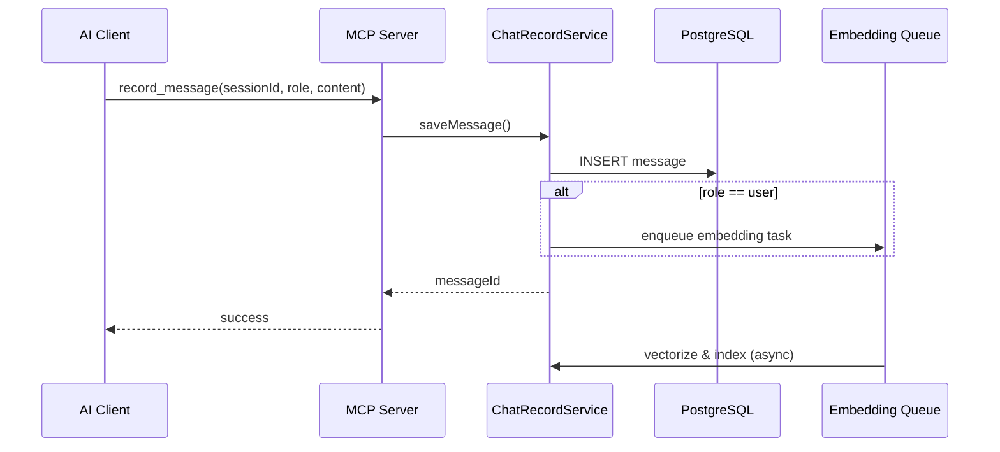
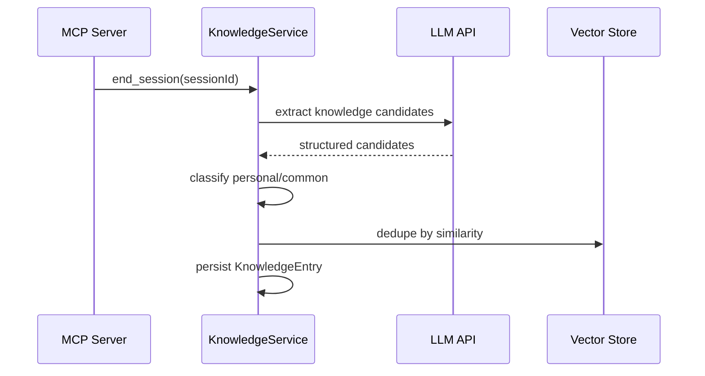

# AI-X 智能对话知识沉淀系统 — 需求文档

> 版本：v1.0  
> 日期：2026-06-11  
> 技术栈：Java  
> 核心形态：MCP（Model Context Protocol）服务

---

## 1. 项目背景与目标

### 1.1 背景

在与 AI 的日常问答过程中，大量有价值的信息（问题、解答、上下文、推理路径）往往随会话结束而流失。用户难以系统性地回顾自己的提问模式、知识盲区，也无法将个人经验与通用技术知识分离沉淀。

### 1.2 项目目标

构建一套基于 **MCP 协议** 的知识沉淀服务，实现：

1. **对话记录**：完整、结构化地保存 AI 对话历史；
2. **问题向量化**：对用户提问进行语义向量化，支撑相似检索与聚类；
3. **个人知识库**：在问答过程中自动积累、组织用户专属知识；
4. **薄弱区分析**：识别用户反复提问、理解偏差或知识链断裂的领域；
5. **通用技术沉淀**：从对话中抽取可复用的通用技术知识，与个人笔记区分管理。

### 1.3 成功标准

| 指标 | 目标 |
|------|------|
| 对话采集完整率 | ≥ 99%（含用户消息与 AI 回复） |
| 问题向量化延迟 | 单条 ≤ 2s（异步可接受） |
| 相似问题检索 | Top-5 召回准确率 ≥ 80%（人工抽样评估） |
| 薄弱区报告 | 每周/按需生成，覆盖 Top-N 主题 |
| MCP 工具可用性 | 与 Cursor / Claude Desktop 等客户端稳定对接 |

---

## 2. 用户与使用场景

### 2.1 目标用户

- **个人开发者**：通过 AI 辅助编码、学习，希望追踪学习曲线与知识盲区；
- **技术学习者**：长期与 AI 问答，需要结构化复习与查漏补缺；
- **团队（可选扩展）**：共享通用技术沉淀，个人薄弱区保持私有。

### 2.2 典型场景

| 场景 | 描述 | 系统响应 |
|------|------|----------|
| 实时记录 | 用户在 IDE 中与 AI 对话 | MCP 工具自动写入会话与消息 |
| 知识检索 | 用户问「我之前问过 Redis 集群吗？」 | 向量检索 + 关键词检索返回历史 |
| 薄弱区复盘 | 用户希望了解近期学习短板 | 生成薄弱主题、频次、关联问题列表 |
| 技术沉淀 | 某次解答具有通用价值 | 抽取为「通用知识条目」，可编辑、打标签 |
| 会话续接 | 继续某历史话题 | 按 session / topic 拉取上下文摘要 |

---

## 3. 系统边界

### 3.1 范围内（In Scope）

- MCP Server 实现（Tools / Resources / Prompts）
- 对话会话与消息的持久化存储
- 用户问题的向量化与向量库存储
- 个人知识库 CRUD 与语义检索
- 薄弱区分析（基于频次、重复问、主题聚类）
- 通用技术知识抽取与分类
- REST / 内部 API（供管理端或批处理使用）
- 基础配置：Embedding 模型、向量库、数据源

### 3.2 范围外（Out of Scope — v1）

- 自建大模型推理服务（调用外部 Embedding / LLM API）
- 多租户 SaaS 计费与权限体系（可预留扩展点）
- 前端管理控制台（v1 可先通过 API + MCP 完成闭环）
- 实时协同编辑、Wiki 全文协作

---

## 4. 功能需求

### 4.1 MCP 服务层

MCP Server 作为 AI 客户端（如 Cursor）的扩展能力入口，对外暴露标准化工具与资源。

#### 4.1.1 MCP Tools（工具）

| 工具名 | 功能 | 输入 | 输出 |
|--------|------|------|------|
| `record_message` | 记录单条对话消息 | sessionId, role, content, metadata | messageId, status |
| `start_session` | 创建新会话 | title, tags, source | sessionId |
| `end_session` | 结束会话并触发摘要 | sessionId | summary |
| `search_history` | 检索历史对话/问题 | query, limit, timeRange | 匹配条目列表 |
| `search_knowledge` | 语义检索知识库 | query, scope(personal/common) | 知识条目 + 相似度 |
| `add_knowledge` | 手动/半自动写入知识 | title, content, type, tags | knowledgeId |
| `get_weak_areas` | 获取知识薄弱区报告 | period, topN | 主题、得分、样例问题 |
| `get_learning_stats` | 学习/提问统计 | period | 频次、主题分布、趋势 |

#### 4.1.2 MCP Resources（资源）

| 资源 URI 模式 | 说明 |
|---------------|------|
| `knowledge://personal/{id}` | 个人知识条目 |
| `knowledge://common/{id}` | 通用技术知识条目 |
| `session://{sessionId}` | 会话详情（消息列表 + 摘要） |
| `report://weak-areas/{period}` | 薄弱区分析报告 |

#### 4.1.3 MCP Prompts（可选）

| Prompt | 用途 |
|--------|------|
| `summarize_session` | 引导 AI 对当前会话生成结构化摘要 |
| `extract_common_knowledge` | 引导 AI 从对话中抽取通用知识点 |

### 4.2 对话记录模块

#### 4.2.1 会话（Session）

- 唯一标识、标题、来源（cursor / cli / api）、标签、开始/结束时间；
- 状态：进行中 / 已结束；
- 可选：会话级摘要（结束或定时生成）。

#### 4.2.2 消息（Message）

- 关联 sessionId；
- 角色：user / assistant / system；
- 内容：纯文本（v1）；可选 token 数、模型名；
- 时间戳、序号；
- 扩展 metadata：文件引用、代码语言、工具调用信息等（JSON）。

#### 4.2.3 采集方式

1. **主动调用**：AI 客户端通过 MCP Tool 在回合结束后写入；
2. **批量导入**（扩展）：支持 JSON / Markdown 对话文件导入。

**需求细则：**

- 同一会话内消息顺序严格递增；
- 支持幂等写入（clientMessageId 去重）；
- 用户消息入库后 **异步触发向量化任务**。

### 4.3 问题向量化模块

#### 4.3.1 向量化对象

-  primarily：**用户提问**（user role 的 message）；
- 可选扩展：会话摘要、知识条目全文。

#### 4.3.2 处理流程

```
用户消息入库 → 清洗（去噪、截断）→ 调用 Embedding API → 写入向量库 → 更新索引状态
```

#### 4.3.3 功能要求

- 支持配置 Embedding 模型与维度；
- 失败重试与 dead-letter 记录；
- 向量与业务 ID 双向关联（messageId / knowledgeId）；
- 支持增量重建索引（管理 API）。

### 4.4 知识库模块

知识库分为两个逻辑域：

| 类型 | 说明 | 默认可见性 |
|------|------|------------|
| **个人知识（Personal）** | 与用户特定上下文、项目、踩坑记录相关 | 仅当前用户 |
| **通用技术知识（Common）** | 可复用的概念、模式、最佳实践 | 用户私有沉淀，可标记「可共享」 |

#### 4.4.1 知识条目字段

- id, title, content, summary；
- type：concept / snippet / qa_pair / checklist；
- sourceType：manual / extracted / imported；
- sourceRef：关联 sessionId、messageId；
- tags, domain（如 java, redis, mcp）；
- embedding 状态；
- createdAt, updatedAt。

#### 4.4.2 知识形成方式

1. **自动抽取**：会话结束后，LLM 结构化抽取候选知识点（需人工确认或自动入库策略可配置）；
2. **手动添加**：用户通过 MCP Tool 明确写入；
3. **问答升格**：高频、高质量 Q&A 对自动候选为知识条目。

#### 4.4.3 检索能力

- 向量相似度检索；
- 关键词 / 标签过滤；
- 混合检索（Hybrid：向量 + BM25，v1.1 可选）。

### 4.5 薄弱区分析模块

#### 4.5.1 分析维度

| 维度 | 说明 | 示例信号 |
|------|------|----------|
| **重复提问** | 语义相似问题在短周期内多次出现 | 同一主题 7 天内 ≥ 3 次 |
| **主题频次异常** | 某领域提问占比高但知识条目少 | Java 并发占 30% 提问、0 条沉淀 |
| **问题深度波动** | 从基础到进阶跳跃、反复回退 | 基础语法与底层原理交替出现 |
| **未闭合话题** | 会话无摘要、无后续知识入库 | 长期「只问不记」 |
| **错题模式**（扩展） | 含 error / exception 关键词的追问链 | NullPointer 相关连续追问 |

#### 4.5.2 输出：薄弱区报告

```json
{
  "period": "2026-W23",
  "weakAreas": [
    {
      "topic": "JVM 垃圾回收",
      "score": 0.82,
      "signals": ["repeat_questions", "low_knowledge_coverage"],
      "sampleQuestions": ["..."],
      "suggestedActions": ["复习 G1 与 ZGC 区别", "整理 GC 调优 checklist"]
    }
  ]
}
```

#### 4.5.3 实现策略（v1）

- 基于 **问题向量聚类**（K-Means / HDBSCAN）得到主题簇；
- 簇内统计：提问次数、时间分布、是否已有对应知识；
- 综合打分公式可配置权重；
- 定期批任务（如每日凌晨）+ 按需 MCP 查询。

### 4.6 通用技术沉淀模块

#### 4.6.1 与个人知识的区分规则

| 判断依据 | 个人知识 | 通用技术知识 |
|----------|----------|--------------|
| 内容特征 | 含项目名、路径、内部配置 | 概念、模式、官方文档式说明 |
| 来源 | 特定 session 上下文强绑定 | 可脱离上下文理解 |
| 抽取 prompt | 保留上下文 | 抽象为领域通用表述 |

#### 4.6.2 沉淀流程

```
对话结束 → LLM 抽取候选 → 分类（personal/common）→ 去重（向量相似）→ 入库 → 打 domain 标签
```

#### 4.6.3 质量保障

- 相似条目合并建议；
- 来源追溯（原始 messageId）；
- 支持用户标记「晋升为通用」或「降级为个人」。

---

## 5. 非功能需求

### 5.1 性能

| 项 | 要求 |
|----|------|
| MCP Tool 同步响应 | record_message ≤ 500ms（不含 embedding） |
| 向量检索 | P95 ≤ 300ms（万级向量） |
| 批分析任务 | 单用户日增量 ≤ 5min 完成 |

### 5.2 可靠性与一致性

- 消息写入 ACID（关系库）；
- 向量索引最终一致；
- 服务重启后可恢复未完成的 embedding 任务。

### 5.3 安全与隐私

- 本地部署优先，对话数据不出境（可配置）；
- API Key 加密存储；
- 敏感信息脱敏（可选规则：密钥、手机号）；
- MCP 连接鉴权（token / mTLS 扩展）。

### 5.4 可扩展性

- 模块化：Embedding 提供商、向量库、LLM 可插拔；
- 预留 userId / tenantId 字段；
- 存储分表或按用户分库策略预留。

### 5.5 可观测性

- 结构化日志（sessionId, messageId, traceId）；
- 指标：写入 QPS、embedding 队列深度、检索延迟、分析任务耗时；
- 健康检查端点。

---

## 6. 数据模型（概念）

```
User (optional v1)
  └── Session
        └── Message ──→ MessageEmbedding (vector)
  └── KnowledgeEntry ──→ KnowledgeEmbedding (vector)
        ├── type: personal | common
        └── sourceRef → Message / Session
  └── WeakAreaReport (periodic snapshot)
  └── TopicCluster (analysis artifact)
```

### 6.1 核心实体关系

- 一个 Session 包含多条 Message；
- 一条 user Message 对应零或一条 MessageEmbedding；
- KnowledgeEntry 可关联零个或多个 source Message；
- WeakAreaReport 由 TopicCluster 与统计数据聚合生成。

---

## 7. 技术架构建议（Java）

### 7.1 整体架构

```
┌─────────────────┐     MCP (stdio/SSE)      ┌──────────────────────┐
│  AI Client      │ ◄──────────────────────► │  MCP Server (Java)   │
│  Cursor/Claude  │                          │  - Tools/Resources   │
└─────────────────┘                          └──────────┬───────────┘
                                                        │
                        ┌───────────────────────────────┼───────────────────────────────┐
                        ▼                               ▼                               ▼
                 ┌─────────────┐                ┌─────────────┐                ┌─────────────┐
                 │  PostgreSQL │                │ Vector DB   │                │ Redis       │
                 │  业务数据   │                │ Milvus/pgvector│              │ 缓存/队列   │
                 └─────────────┘                └─────────────┘                └─────────────┘
                                                        │
                                                        ▼
                                               ┌─────────────────┐
                                               │ Embedding API   │
                                               │ (OpenAI/Ollama) │
                                               └─────────────────┘
```

### 7.2 技术选型建议

| 层次 | 推荐方案 | 说明 |
|------|----------|------|
| 语言 | Java 17+ | LTS，生态成熟 |
| 框架 | Spring Boot 3.x | Web、调度、配置、生态 |
| MCP SDK | 官方/社区 Java MCP SDK | 实现 Server 协议 |
| ORM | MyBatis-Plus | 实体映射；注意 `@TableField` 驼峰转下划线 |
| 关系库 | PostgreSQL | 可配合 pgvector 简化部署 |
| 向量库 | pgvector / Milvus | 按规模选型 |
| 缓存/队列 | Redis + Spring Task / MQ | embedding 异步 |
| Embedding | OpenAI / 本地 Ollama | 可配置切换 |
| 分析 | 内置算法 + 可选 LLM 摘要 | 薄弱区、知识抽取 |
| 构建 | Maven / Gradle | 与团队习惯一致 |

### 7.3 模块划分

```
ai-x/
├── ai-x-mcp-server      # MCP 协议入口、Tool/Resource 实现
├── ai-x-core            # 领域模型、业务服务
├── ai-x-storage         # MyBatis-Plus、Repository
├── ai-x-vector          # Embedding、向量检索
├── ai-x-analysis        # 薄弱区、聚类、报告
├── ai-x-api             # REST 管理接口（可选）
└── ai-x-common          # 工具类、配置、异常
```

---

## 8. 关键业务流程

### 8.1 对话记录流程



### 8.2 知识沉淀流程



### 8.3 薄弱区分析流程

1. 拉取周期内所有 user Message；
2. 读取已有向量，执行主题聚类；
3. 计算簇级指标（频次、重复度、知识覆盖率）；
4. 生成 WeakAreaReport 并持久化；
5. 通过 MCP Tool `get_weak_areas` 对外提供。

---

## 9. 接口需求摘要

### 9.1 MCP Tools 错误码约定

| code | 含义 |
|------|------|
| OK | 成功 |
| INVALID_ARGUMENT | 参数错误 |
| SESSION_NOT_FOUND | 会话不存在 |
| DUPLICATE_MESSAGE | 重复消息（幂等） |
| EMBEDDING_FAILED | 向量化失败（已入重试队列） |
| INTERNAL_ERROR | 内部错误 |

### 9.2 REST API（管理面，v1 可选）

| 方法 | 路径 | 说明 |
|------|------|------|
| GET | /api/sessions | 分页查询会话 |
| GET | /api/sessions/{id}/messages | 消息列表 |
| GET | /api/knowledge | 知识库检索 |
| GET | /api/reports/weak-areas | 薄弱区报告 |
| POST | /api/admin/reindex | 重建向量索引 |

---

## 10. 配置项

| 配置键 | 说明 | 默认值 |
|--------|------|--------|
| embedding.provider | openai / ollama | ollama |
| embedding.model | 模型名称 | nomic-embed-text |
| vector.store | pgvector / milvus | pgvector |
| analysis.weak-area.topN | 报告返回主题数 | 10 |
| analysis.repeat-window-days | 重复提问窗口 | 7 |
| knowledge.auto-extract | 会话结束自动抽取 | true |

---

## 11. 里程碑规划

| 阶段 | 交付物 | 周期建议 |
|------|--------|----------|
| **M1：基础闭环** | MCP Server + 会话/消息入库 + record/start/end | 2 周 |
| **M2：向量检索** | Embedding 异步 + search_history / search_knowledge | 2 周 |
| **M3：知识库** | 知识 CRUD + 自动抽取 + personal/common 分类 | 2 周 |
| **M4：分析能力** | 薄弱区报告 + get_weak_areas + 定时任务 | 2 周 |
| **M5：打磨** | 可观测性、导入、文档、部署脚本 | 1 周 |

---

## 12. 风险与依赖

| 风险 | 影响 | 缓解措施 |
|------|------|----------|
| MCP 客户端调用不稳定 | 对话漏记 | 幂等 + 本地缓冲 + 批量补录 |
| Embedding 成本高 | 运营费用 | 本地模型、批量、仅向量化 user 问 |
| 薄弱区误判 | 用户信任下降 | 可解释信号 + 人工反馈标记 |
| 知识抽取质量参差 | 库内噪声 | 去重、人工晋升、质量分 |

**外部依赖：** Embedding API、（可选）LLM API、PostgreSQL、向量库、Redis。

---

## 13. 验收标准（v1）

- [ ] MCP Server 可被 Cursor 配置并正常发现 Tools；
- [ ] 完整记录至少 100 轮对话且无丢失；
- [ ] 用户问题向量化率 ≥ 95%；
- [ ] search_knowledge 返回语义相关结果；
- [ ] get_weak_areas 能识别故意制造的重复提问主题；
- [ ] 至少 10 条通用技术知识自动抽取并正确分类；
- [ ] 服务异常重启后 embedding 任务可续跑。

---

## 14. 术语表

| 术语 | 定义 |
|------|------|
| MCP | Model Context Protocol，AI 客户端与外部工具/资源的标准协议 |
| Embedding | 将文本映射为稠密向量以支持语义相似度计算 |
| 薄弱区 | 用户在一段时间内理解不足或反复挣扎的知识主题 |
| 通用技术沉淀 | 不依赖特定项目上下文、可复用的技术知识 |
| Hybrid Search | 向量检索与关键词检索的组合 |

---

## 15. 附录：后续演进方向

- 多用户与团队共享通用知识库；
- 可视化学习曲线 Dashboard；
- 与 IDE 代码上下文关联（文件路径、Git commit）；
-  spaced repetition 复习提醒；
- 导出 Anki / Markdown 笔记；
- 支持多语言分析与报告。
